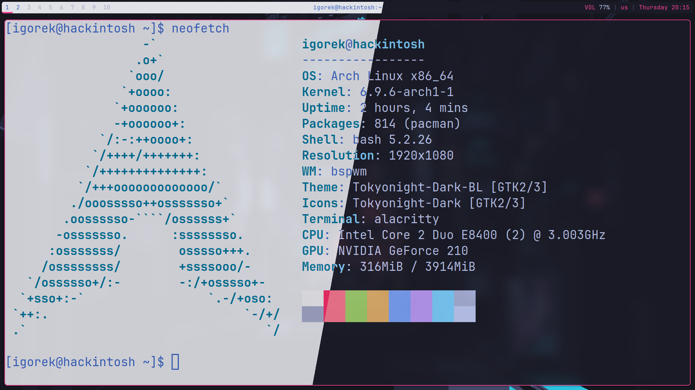
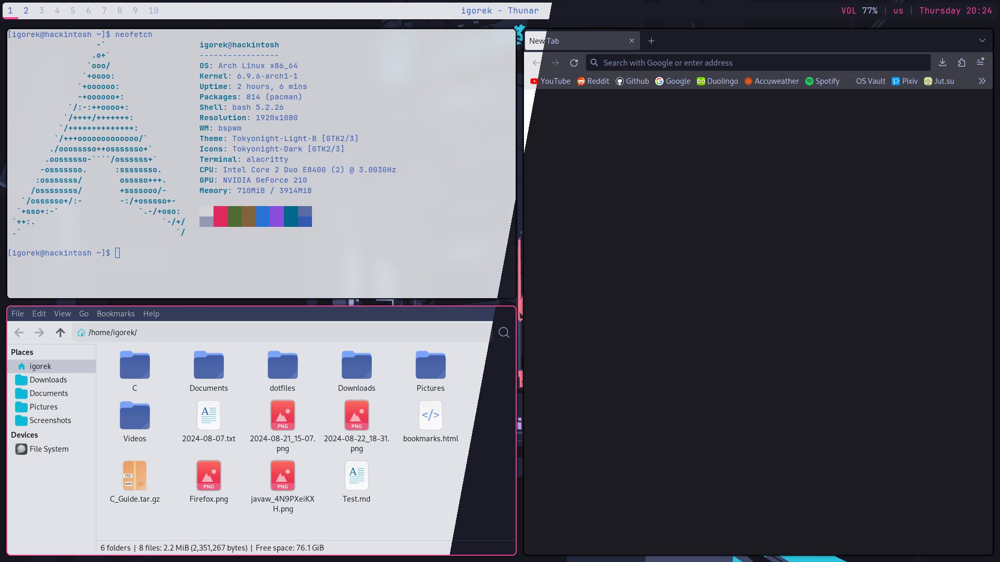

# IGOREK_Belarus's dotfiles

### Information

- **OS**: Arch Linux
- **Login manager**: ly
- **Window manager**: BSPWM
- **Bar**: Polybar
- **Notifications**: Dunst
- **Compositor**: Picom
- **Theme**: [GTK3 TokyoNight](https://github.com/Fausto-Korpsvart/Tokyo-Night-GTK-Theme) ([Specifically this commit](https://github.com/Fausto-Korpsvart/Tokyonight-GTK-Theme/commit/94fba793d3e25f1da0f769d4f41e2fff6e1d0724))
- **Icons**: oomox-Tokyonight
- **Terminal**: Alacritty
- **App menu**: Rofi
- **Browser**: Firefox ESR, quteBrowser
- **Code editor**: VS Codium, NVim
- **Colors:** TokyoNight (Day, Moon, Storm, Night)

### Keybinds

| Keybind | Action |
| --- | --- |
| Super + Return/Enter | Launch **Alacritty** |
| Super + Space | Launch **Rofi** |
| Super + Alt + Escape | Reload sxhkd's configs |
| Print | Make screenshot |
| ~~Print + Shift~~ | ~~Make screenshot of active window~~ |
| Print + Ctrl | Make screenshot and open a flameshot GUI |
| Super + Alt + Q | Quit BSPWM |
| Super + Alt + R | Restart BSPWM |
| Super + W | Close |
| Super + Shift + W | Kill |
| Super + M | Toogle between tiled and monocle layot |
| Syper + Y | Send the newest marked node to the newest preselected node |
| Super + G | Swap the current node and the biggest window |
| Super + T | Set the window state to **tiled** |
| Super + Shift + T | Set the window state to **pseudo tiled** |
| Super + S | Set the window state to **floating** |
| Super + F | Set the window state to **fullscreen** |
| Super + Ctrl + M | Set the node flag **marked** |
| Super + Ctrl + X | Set the node flag **locked** |
| Super + Ctrl + Y | Set the node flag **sticky** |
| Super + Ctrl + Z | Set the node flag **private** |
| Super + Shift + H | Focus next node in direction **west** |
| Super + Shift + J | Focus next node in direction **south** |
| Super + Shift + U | Focus next node in direction **north** |
| Super + Shift + K | Focus next node in direction **east** |
| Super + C | Focus the next winow in the current desktop |
| Super + Shift + C | Focus the previous window in the current desktop |
| Super + [ | Focus the previous desktop in the current monitor |
| Super + ] | Focus the next desktop in the current monitor |
| Super + O | Focus the older node in focus history |
| Super + I | Focus the newer node in focus history |
| Super + {Number} | Go to {Number} desktop |
| Super + Shift + {Number} | Send focused window to {Number} desktop |
| Super + Ctrl + H | Preselect the direction **west** |
| Super + Ctrl + J | Preselect the direction **south** |
| Super + Ctrl + K | Preselect the direction **north** |
| Super + Ctrl + L | Preselect the direction **east** |
| Super + Ctrl + {Number} | Preselect the ratio |
| Super + Ctrl + Space | Cancel the preselection for the focused node |
| Super + Ctrl + Shift + Space | Cancel the preselection for the focused desktop |
| Super + Alt + H | Expand a window by moving it to **left** side outward |
| Super + Alt + J | Expand a window by moving it to **bottom** side outward |
| Super + Alt + K | Expand a window by moving it to **top** side outward |
| Super + Alt + L | Expand a window by moving it to **right** side outward |
| Super + Alt + Shift + H | Contract a window by moving it to **right** side inward |
| Super + Alt + Shift + J | Contract a window by moving it to **top** side inward |
| Super + Alt + Shift + K | Contract a window by moving it to **bottom** side inward |
| Super + Alt + Shift + L | Contract a window by moving it to **left** side inward |
| Super + Left | Move a floating window to the **left** |
| Super + Down | Move a floating window to the **bottom** |
| Super + Up | Move a floating window to the **top** |
| Super + Right | Move a floating window to the **right** |